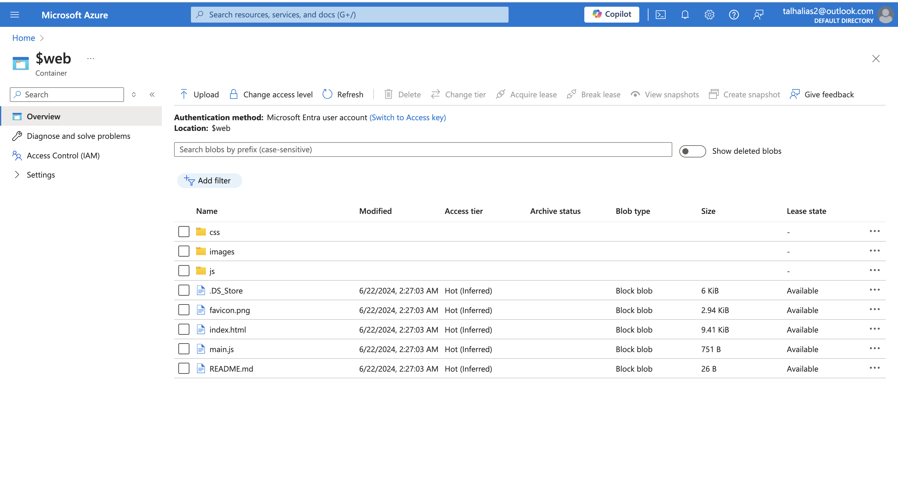

# Azure Cloud Resume Challenge
Welcome to my Cloud Resume Challenge for Azure project! ☁️

## [My Web - Click Here!](https://www.talresume.online/)

I began by mastering the basics and earned my AZ-900 Azure Fundamentals certification. After completing the certification, I dedicated myself to the Cloud Resume Challenge for Azure.

Over the course of two intensive weekends, totaling around 30-40 hours, I devoted significant effort to this project. Whether you're an experienced professional or new to Azure, I hope my project inspires and assists you on your own cloud computing journey. Let's dive in together!

# This challenge is composed of 8 main parts:

1. Configure a Static Website via Azure Storage with a custom domain and HTTP
2. Write your resume in HTML and formatting it with CSS
3. Setup Azure Storage account and enable Static Website
4. Infrastructure as Code by using Terraform
5. Enable CDN for HTTPS access to your website and custom domain
6. Use Azure Functions App to interact with CosmosDB API to update a visitor counter
7. Write javascript to capture the result of the visitor counter function and display it on the site
8. Configure GitHub Actions for CI/CD with Azure Storage

## Prerequisites
- Azure account
- GitHub account
- Azure CLI
- Azure Functions Core Tools
- Visual Studio Code
- Visual Code Extensions
- Azure Functions Extensions
- C# Extension
- Azure Storage Extension
- A cheap domain provider 

## Front-end
## Phase-1 (Building the Resume-Website)

So the first phase was to build a resume static website using html and css. Since I didnt want to spend too much time on desinging the resume website I used a template from the internet and altered the code depending on how I wanted it to look. Then I added all the details necessary for the resume page.

This is the result of the staic resume page.

## Phase-2 (Hosting the website in azure)

This phase is all about deploying the static site to the cloud. In Azure we can achieve this by deploying the static site to a blob storage. Azure Blob storage has an option to configure it to host static websites. Once configured you can find a container named as $web. Now you can upload the website files directly from the portal or the cli. I personally chose to do it through the cli. The image below shows you the uploaded files for the static site in the blob storage

And you can access the static website through the primary endpoint given by azure for this particular site. [You can find it in the capabilites section in the overview of the Blob account and click "Static website" and find the primary and secondary endpoints], later i connected the Domain I purchased to the Static website to generate a short and accessible url.

## Phase-3 (Domain and CDN)
I bought a domain (on godaddy -  <a href="https://www.talresume.online/"> resumedorav.online</a>) for this project. 
I could have used Azure DNS but my subscription credits wasnt able to actually get a domain name. Then I pointed this domain to the Azure CDN endpoint. CDN refers to content delivery network. It is a network of multiple proxy servers with a primary goal of delivering content with high availability. So users across different geographical locations can access it faster.
  

## Back-end
## Phase-4 (Javascript-webapp)
Now we have a static website to display our resume. The next challenge was to create a counter to keep track of how many times the page has been visited and this can be achieved using js. 
I used an event listener to trigger and call the `main.js` function whenever the dom elements or content gets reloaded. This function sends a http request to the azure function( we will talk about it in the next phase) to get the count and display it in the website. You can take a look at the code to understand how it has been done. Its simply is a basic get request.

## Phase-5 (Azure functions)
Now comes the important part. I have to create a function to update the count of the visitors everytime the page is reloaded. This can be acheived by using HTTP trigger for the function. Which means the function will run everytime the page gets reloaded. So I created a function to fetch the count from the Azure cosmos DB( next phase) and then update the count by increasing it by one and then returning it to the front end so that it can display the count. 

## Phase-6 (Azure Cosmos DB)
Now I have to create a cosmos Db to store the number of visitors. The database itself is also serverless so I only had to pay for the usage. After creating the database , I created a table to enter the visiter count value. I used Table API to retrieve and update the count value. Since this was my frist time working with Table in Cosmos DB , It took me some time to understand how the data works and how the whole table is structured. This document helped me understand how it works.

## Phase-7 (Terraform)
After creating the application with the necessary services , its time to automate the whole application. To automate the process of provisioning the resources in azure we can use terraform which is an IaC tool. Since in the previous phase I have already provisioned the resources using the cli and the portal I had to find a way to manage those resources.So I created an <a href="https://developer.hashicorp.com/terraform/language/import">import.tf file to create a state file for the existing resources</a> in the cloud provider. This was done by using the <a href="https://developer.hashicorp.com/terraform/language/import">import block</a>. After getting the state files I performed operations as how we would do normally while creating the resoruces from the start. After this I made the necessary changes needed to automate the provisioning such as storing the application setting variables. Coming to variables I stores few of them in the tfvars.tf file while for the variables that are meant to be a secret, I passed them as environmental variables( yes you can store the values of terraform variables as <a href="https://awstip.com/managing-secrets-on-terraform-71ed245a455f">env variables just make sure you give it a prefix like TF_VAR_<variable-name></a>) in the local machine, of cource there are many other ways to store and reference them but I personally chose this for this project. When it comes to automating the provisioning using CICD, I pass the values as secrets so the pipeline can use that to provision the resources with variable's values which are encrypted. Also for automating the provisioning using CICD, I had to store the state files in a backend. The backend used here is Terraform cloud. You can store it in any other vaults or backend. We will discuss about how the pipelines accesses those state files to provision the resources in the next Phase.

## CI/CD
Once I had the storage container and static website setup, it was really nice to be able to push updates via GitHub and have a Workflow automatically update the contents of the container. Plus this workflow purges the CDN cache so that any updates you make are immediately reflected.
- I followed Microsoft's docs on [Using GitHub Actions workflow to deploy a static website in Azure Storage](https://learn.microsoft.com/en-us/azure/storage/blobs/storage-blobs-static-site-github-actions?tabs=userlevel) which was mostly straightfoward. 
- Every required secret for backend job ,terraform and frontend job are stored as secrets in github actions. 
- Creating a cicd pipeline definitely improve the development process so the developers can focus on the product instead of focusing on deployment and management of it.
